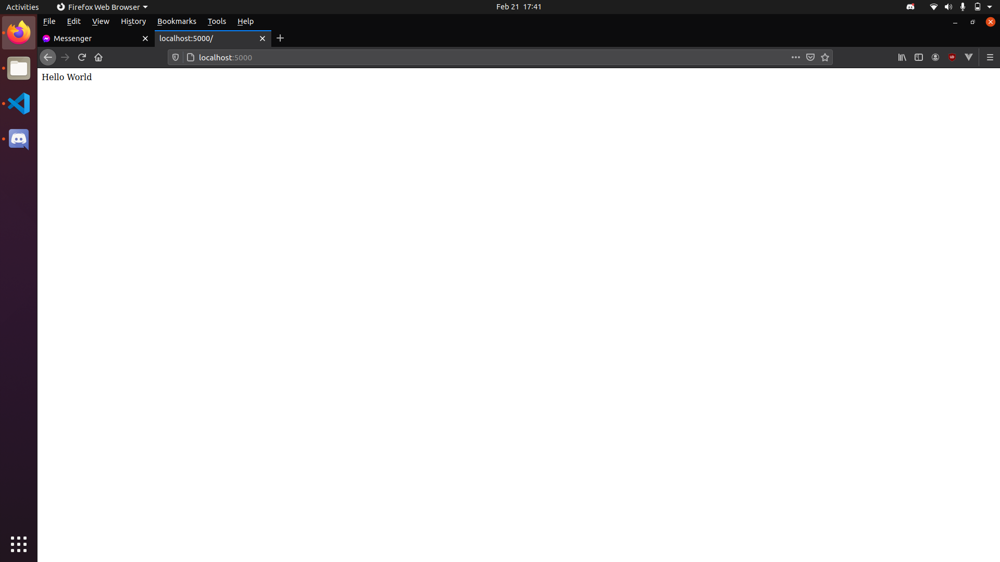

# Web Development

### Tech Stack (MEHN)

- Mongodb
- Express
- Handlbars/Hbs
- NodeJS

### Requirements

**Software that are needed to be installed**

- Nodejs and Npm - [Latest](https://nodejs.org/en/download/current/)
- MongoDB Community Server - [Latest](https://www.mongodb.com/try/download/community)
- Basic knowledge of Ecmascript 6 (ES6), HTML and CSS - [Tutorial](https://github.com/KysonnDelaCerna/JavaScript-ES6-Tutorial)

### Setup

To start your project, select a directory that will house your application and create an empty folder (I'll use a webdev-project as my folder name; you can name this whatever you want). Open your terminal and locate the specific folder and enter the following command:

```
webdev-project> npm init -y
```

This command will add a `package.json` to the directory. This file is very important as it tracks all the dependencies you have on your project and the current version of those modules. The next step is to install the express module from the **npm** command so go back to the terminal and type:

```
webdev-project> npm install express
```

To verify that the module was installed, you should see a new folder called _node_modules_. This is where all the packages you installed through **npm** will go.

Once that is installed, create a file `app.js`, this will be our entry point for our application. The contents of the file should be:

```javascript
const express = require("express"); // import the express package

const app = express();

const PORT = 5000;

app.get("/", (_req, res) => {
  return res.send("Hello World");
});

app.listen(PORT, () => {
  console.log(`Listening to port: ${PORT}`);
});
```

Once you create this file, you can now deploy your web application this with the command:

```
webdev-project> node app
```

The command should log out _Listening to port: 5000_. You can now access the site using your browser by typing _localhost:5000_ on the URL bar, which should show this:



Congratulations! You have your first web application.

---

### Nodemon

But we will encounter a problem when we want to change something on the `app.js` file but wouldn't immediately reflect to the server. Let's try editing this line:

```javascript
app.get("/", (_req, res) => {
  return res.send("Hello World");
});
// Change to
app.get("/", (_req, res) => {
  return res.send("Hi World");
});
```

Once you save the file then access the site, it will still give you the message "Hello World". To solve this, we need to restart the server by pressing **Ctrl + C** and rerunning the command of _node app_. There is no problem with doing this, but it becomes tedious when you have to edit and restart the server manually. To make our lives easier, there is a module that watches the files for us so once we edit and save, the server automatically restarts. That module is called **nodemon**. You can install the module by using the npm command:

```
webdev-project> npm i --save-dev nodemon
```

This module will be installed to our application, but as you can see there is difference when we installed the _express_ module with the additional tag **--save-dev** which just means that the module is just installed when you are in a development mode. This mode is only for the developers so that it would be easier to code the application, and at the same time, it is not needed when we deploy it to production (or to the public). Then we can edit the `package.json` file and edit the **scripts** key to have these values:

```json
...
"scripts": {
  "dev": "nodemon app"
},
...
```

So you can run the nodemon command through the `package.json` file by using the command:

```
webdev-project> npm run dev
```

And once we try and change something on `app.js` like changing the 'Hi World' into 'Test', then it should automatically restart the server for us.

---

### Folder Structure

The folder structure is very important in making our application; a very organized folder structure can help us locate the files we need to edit much easier. The folder structure I follow is as shown:

```
webdev-project(main folder)
+ - ctrl    # controller functions
+ - mw      # middleware functions
+ - routers # routing
+ - static  # static files (js/css/images)
+ - views   # templates
+ - app.js
+ - package.json
```

To understand each folders' functionality, let's adjust the app.get function located in the `app.js` file. We will need three files for this:

/ctrl/index.js

```javascript
const indexCtrl = {
  getIndex: (_req, res) => {
    return res.send("Hello World");
  },
};

module.exports = indexCtrl;
```

The controller should process the data and update the database and send a file or an html to the user. This should be the where we send our response to the client.

/mw/index.js

```javascript
const indexMw = {
  sample: (_res, _req, next) => {
    console.log("I'm a middleware");
    next();
  },
};

module.exports = indexMw;
```

The middlewares is mostly for validation, it should check whether the data given by the user is good and not break our database.

\*/routers/**\*index.js**

```javascript
const router = require("express")();
const mw = require("../mw/index");
const ctrl = require("../ctrl/index");

router.get("/", mw.sample, ctrl.getIndex);

module.exports = router;
```

The router is responsible for routing the paths of the application, and combines the middleware and controller functions that will be used.

/app.js

```javascript
const express = require("express");

const app = express();

const PORT = 5000;

const indexRtr = require("./routers/index");
app.use("/", indexRtr);

app.listen(PORT, () => {
  console.log(`Listening to port: ${PORT}`);
});
```

So when we try to access _localhost:5000/_, it will give us a `Hello World` string. We haven't changed any logic or added another route yet, so let's try adding another URL path like _/sample_. To do that, we have to add to the _route_ and _ctrl_ files. The files should look like this:

/ctrl/index.js

```javascript
const indexCtrl = {
  getIndex: (_req, res) => {
    return res.send("Hello World");
  },
  getSample: (_req, res) => {
    return res.send("This is the sample path");
  },
};

module.exports = indexCtrl;
```

/routers/index.js

```javascript
...
router.get('/',
  mw.sample,
  ctrl.getIndex
);

router.get('/sample',
  ctrl.getSample
);

module.exports = router;
```

And there you go, we have created another path to our website. You can now access _localhost:5000/sample_ and see a different message.

---

### Router Folder

Our current router folder has only one file; but we can have multiple router files to point to different URL paths in our web application. Llet's try adding a new router file called `test` along with the additional files to the ctrl folder. Take note that you can name these files differently; I name the files similarly so that it is easy to trace later on.

/ctrl/test.js

```javascript
const testCtrl = {
  getIndex: (_req, res) => {
    return res.send("Test Route");
  },
};

module.exports = testCtrl;
```

/router/test.js

```javascript
const router = require("express")();
const ctrl = require("../ctrl/test");

router.get("/", ctrl.getIndex);

module.exports = router;
```

/app.js

```javascript
const express = require("express");

const app = express();

const PORT = 5000;

const indexRtr = require("./routers/index");
const testRtr = require("./routers/test");

app.use("/", indexRtr);
app.use("/test", testRtr);

app.listen(PORT, () => {
  console.log(`Listening to port: ${PORT}`);
});
```

The first thing you will notice in the `app.js` file is the _app.get('/test', testRtr);_ and it's just an indicator that when you see '/test' in the URL, the router handling that will be handled by the `router/test.js` file.

When you look at the routing as well, '/test' isn't necessary to add in the path of the _.get()_ function in /router/test.js; this is because '/test' was appended at the start of the URL path when you linked it to the `app.js` file.

When you go to _localhost:5000/test_ then it should work and return the message. If we try adding another route in the `router/test.js` like a path to '/hello' it will be routed in the app to _localhost:5000/test/hello_ which is a very helpful tool when routes are tied to user access and privileges such as admin pages.

---

### Adding Handlebars

So we can send a string to our users but we want to give them an html file with design and logic. There are a lot of ways to server html files with express but in this tutorial we will use the handlebars templating engine which is simple enough to use. To start we need to
